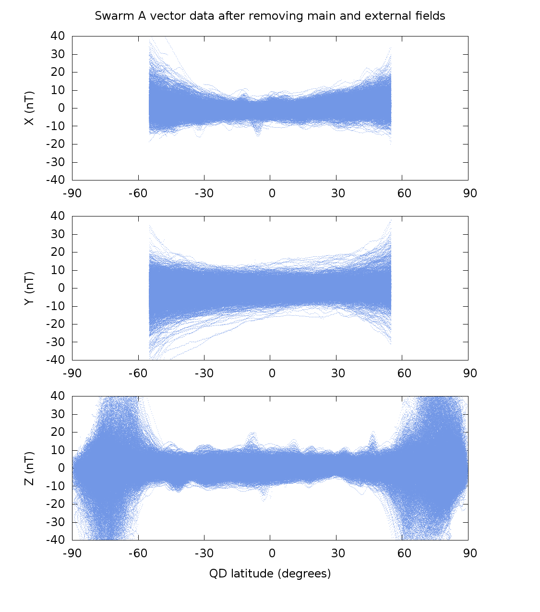
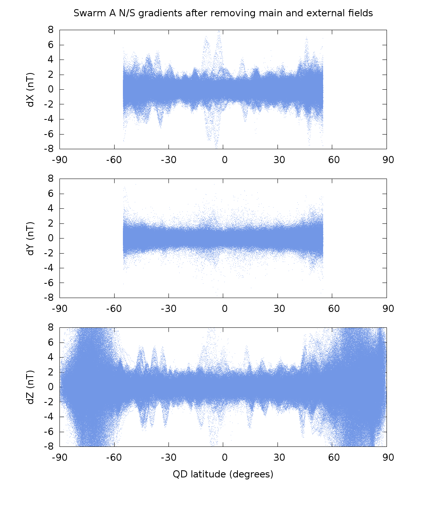
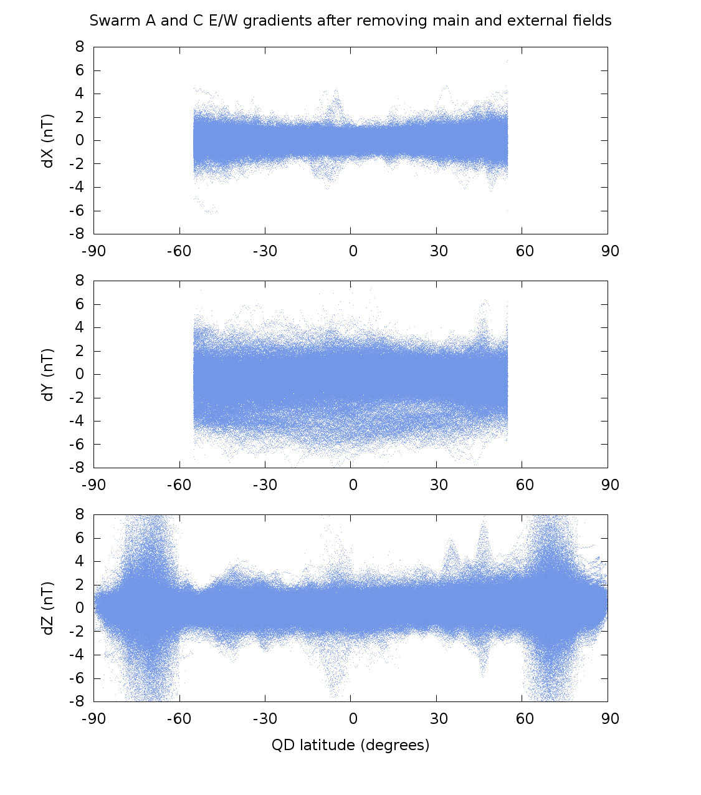

******************
Data Visualization
******************

Plotting the input dataset
==========================

Before running the model it is a good idea to plot the entire
dataset which will go into the modeling. For the crustal field
calculation, a main and external field model are first removed
from the satellite data. The resulting vector residuals for Swarm A
are shown below.

The N/S gradient data also for Swarm A is shown below:

In both cases, we use only Z data at high-latitudes to attempt to
minimize contamination by the polar ionospheric current systems.
In the figure below, we plot the E/W gradients between Swarm A and
C.

Here we can see some larger gradients in the X and Y components. The
origin of these is currently unclear and for the time being I fit only
the Z gradient data.
